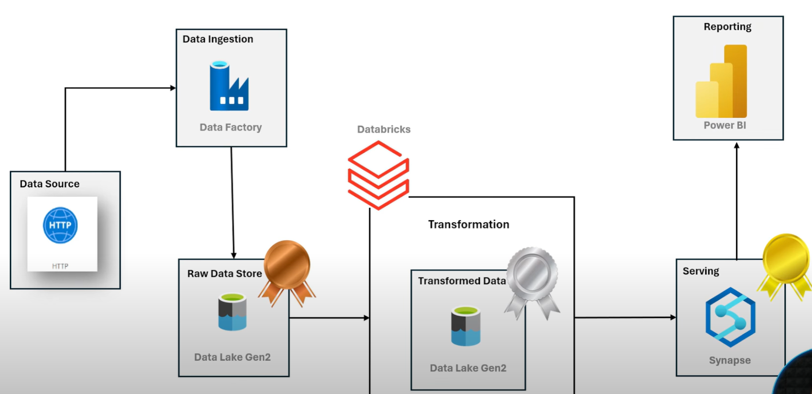
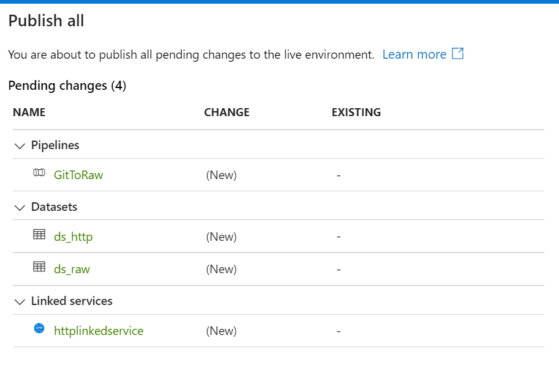
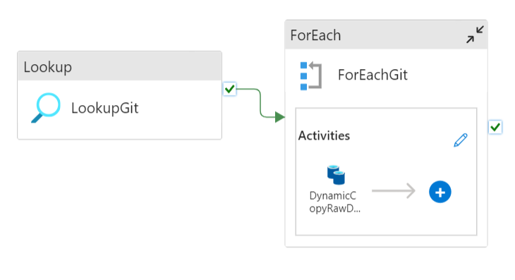
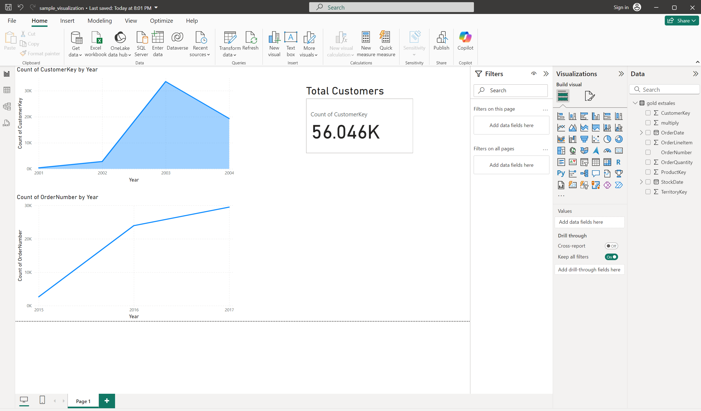

# Azure End-to-End Data Engineering Pipeline

This project demonstrates an end-to-end data engineering pipeline on Azure, using the Adventure Works dataset. It covers data ingestion, storage, transformation, and visualization.

## Data Source

[Adventure Works Dataset on Kaggle](https://www.kaggle.com/datasets/ukveteran/adventure-works)

## Architecture



## Tech Stack

- **Azure Data Factory**: Data integration and workflow orchestration.
- **Azure Data Lake Storage Gen2**: Highly scalable and secure data storage.
- **Azure Databricks**: Data engineering, transformation, and aggregation.
- **Azure Synapse Analytics**: Data warehousing and analytics service.
- **Power BI**: Data visualization and business intelligence.
- **SQL**: Storing processed data for analysis (Gold Layer).
- **Pyspark**: For Transformations in Silver Layer.


## Steps Followed

### Setup Resources

- **Create Resource Group**: `AWPROJECT`
- **Create Storage Account**: `lmamidiawstorage`
  - Primary Service: Azure Data Lake Storage Gen 2
  - Performance: Standard
  - Redundancy: Locally-redundant storage (LRS)
  - Enable hierarchical namespace: This option creates a Data Lake instead of blob storage.
  - Access Tier: Hot

- **Create Azure Data Factory**: `lmamidi-adf-aw`
  - Navigate to the storage account, under Data Storage, click on Containers to create `bronze`, `silver`, and `gold` layers.


### Azure Data Factory Configuration

- Open azure data factory studio and **Create 2 Linked Services**:
  - **Source: HTTP**:
    - Name: `httplinkedservice`
    - Base URL: `https://raw.githubusercontent.com`
    - Authentication: Anonymous
  - **Source: Azure Data Lake Storage Gen2**:
    - Name: `datalakelinkedservice`
    - Storage Account Name: `lmamidiawstorage`

#### Static Pipeline (To copy data from source to destination)

- In Author tab: create a pipleine `GitToRaw`
    - Drag "Copy Data" activity and name it as `CopyRawData`
        - In "source" tab, create new data source `http` and file format as `csv` ---> Name: `ds_http`
            - Linked service: select `httplinkedservice`
            - Relative URL: `lokesh-venkata-sai/Adventure_works_Data_Engineering_Pipeline/refs/heads/main/Data/AdventureWorks_Products.csv`
            - click OK
        - In "sink" tab, create a new sink data source `Azure Data Lake Storage Gen2` and format as `csv` ---> Name: `ds_raw`
            - Linked service: `datalakelinkedservice`
            - File path: `bronze`/`products`/`products.csv`
    - Click on "Debug" --> To run the pipeline
- "Publish all"

    

- since we have around 10 files we need to create 10 different pipelines. But this is not a standard approach. We should create a Dynamic pipeline.

#### Setup Dynamic Pipeline

- In Author tab: create a pipleine `DynamicGitToRaw`
    - Drag "Copy Data" activity and name it as `DynamicCopyRawData`
        - In "source" tab, create new data source `http` and file format as `csv` ---> Name: `ds_http_dynamic`
            - Linked service: select `httplinkedservice`
            - In Advanced: Click on "Open this dataset"
            - Relative URL --> Add Dynamic content
            - Create a new parameter `p_rel_url` of `string` type
            - click on `p_rel_url` and OK
        - In "sink" tab, create a new sink data source `Azure Data Lake Storage Gen2` and format as `csv` ---> Name: `ds_raw_dynamic`
            - Linked service: `datalakelinkedservice`
            - In Advanced: Click on "Open this dataset"
            - File path: file system -> `bronze`
            - Directory -> add dynamic content -> Create a new parameter `p_sink_folder` of `string` type
            - File name -> add dynamic content -> Create a new parameter `p_file_name` of `string` type
        
        - Now if we see the source, sink tab in total we need to provide 3 parameters as inputs for copy activity `p_rel_url`, `p_sink_folder`, `p_file_name`
    - Before proceeding further let's upload a `git.json` file to azure in data lake storage by creating a `parameters` container
    - Drag "lookup" acticity and name as `LookupGit`
        - In settings, create a new sink data source `Azure Data Lake Storage Gen2` and format as `json` ---> Name: `ds_git_parameters`
        - Linked service: `datalakelinkedservice`
        - File path: Browse the `git.json` file
        - Uncheck "First row only"
    - Connect "Lookup" activity On success to "For each"
    
        
    
    - Drag "ForEach" activity and name it as `ForEachGit`
        - In settings tab, check the box Sequential
        - Items: Add dynamic content --> select LookupGit value array --> OK
    - Now, cut the `DynamicCopyRawData` activity --> select `ForEachGit` activity --> Inside activities tab --> click on pencil symbol --> (now we are inside foreach activity) paste `DynamicCopyRawData` activity
    - Now, select Copy Data Activity
        - Inside source tab --> `p_rel_url` Add dynamic content --> `@item().p_rel_url` (p_rel_url: parameter inside json file) --> OK
        - Do the same for other two parameters accordingly in Sink tab
- Now, click on "Debug" to run the pipeline. 
- You can check that files will be present inside the data lake storage.

### Azure Databricks (Silver Layer)

- **Create Azure Databricks Workspace**: `adb-aw-project`
  - Pricing Tier: Trail (14 days Free)
  - Managed Resource group name: `managed-adb-aw-project`
  - Click Create
  - In compute Tab, click on + to create compute
    - Cluster Name: `AWProjectCluster`
    - Single Node
    - Access mode: No isolation shared
    - Node type: `Standard_DS3_V2`
    - Uncheck "Use Photon Acceleration"
    - Terminate After: 20

- **Permissions Setup**: Now, we need to setup permissions for databricks to access the data lake
    - First way: we can use microsoft entra ID to create an service application to be kept in between Databricks and datalake
    - Another way: We can use azure storage access key to access data lake
        - Run this code in notebook
        ```python
        spark.conf.set(
            "fs.azure.account.key.<storage-account>.dfs.core.windows.net", "<storage-account-access-key>"
        )

- **Tranformations**: In Workspace Tab, create a folder `AW_Project`
    - In `AW_Project`, create a notebook `silver_layer`
        - In top, connect to cluster `AWProjectCluster`
        - Now write a code for transformations and then write the transformed data into `silver` container of datalake storage `lmamidiawstorage`
        - refer to `Scripts/silver_layer.ipynb` file for code

### Synapse Analytics  (For Gold Layer)

- **Setup**: Now, create a resource --> Azure Synapse Analytics
    - Resource group: `AWPROJECT`
    - Managed resource group: `rg-managed-awproject-synapse`
    - Workspace name: `lmamidi-awproject-synapse`
    - Select Data Lake storage -->
        - Account Name: create new --> `lmamididefaultsynapse`
        - File system name: create new --> `defaultsynapsefile`
    - Click Next
    - In security tab, 
        - SQl Server admin login name: `adminlokesh`
        - SQL pwd: `<some-password>`
    - Create

- **Data Lake Connection**: Connect Azure Synapse Analytics to Data Lake
    - Go to data lake storage --> Access Control (IAM) -->
(+) Add Role Assignment --> Select Role `Storage Blob Data Contributor`
    - Next, Select "Managed Identity"
    - Members: + Select Members
        - Managed Identity: Synapse Workspace
        - Select `lmamidi-awproject-synapse`
    - Review + Assign

    - Go to data lake storage --> Access Control (IAM) -->
(+) Add Role Assignment --> Select Role `Storage Blob Data Contributor`
    - Next, Select "User, group, or service principal"
    - Members: + Select Members
        - select `<your-azure-account-emailID>`
    - Review + Assign

- In Azure Synapse Analytics
    - In Develop tab, Add SQL Script
    - In Data tab, Create SQL database --> "Serverless" --> Database name: `aw_database` --> create
    - Now, In SQL Script, we can see the database we created. Select `aw_database` for the script to use.
        - Use `OPENROWSET` function to see the data from data lake
        - Get URL of a folder from data lake using properties example: https://lmamidiawstorage.blob.core.windows.net/silver/AdventureWorks_Calendar/
        - Replace `blob` with `dfs`. So, result will be example: https://lmamidiawstorage.dfs.core.windows.net/silver/AdventureWorks_Calendar/
        - Mention the above url in `OPENROWSET` to read data.
        - Example SQL query
            ```sql 
            SELECT 
                * 
            FROM 
                OPENROWSET(
                        BULK 'https://lmamidiawstorage.dfs.core.windows.net/silver/AdventureWorks_Calendar/',
                        FORMAT = 'PARQUET'
                ) as query1
    - Now, create views for all the data files from silver layer
        - Refer to `Create_views_gold.sql` file
    - Create External Tables (3 steps)
        - Credential
        - External Data Source
        - External File Format
    - Let's create
        - First setup master key
            ```sql
            CREATE MASTER KEY ENCRYPTION BY PASSWORD ='<some-password>'
        - Setup data source for silver, gold layers
        - Setup file format
        - Refer to `create_exteral_table.sql` file for code
        - Now, we create external tables using `CETAS` from views we have created

### Visualization with Power BI

- Now, Install Power BI Desktop
- Connect Power BI to the data
    - Get serverless SQL Endpoint from azure synapse resource
    - Click on Get Data in blank report --> Select Azure --> Azure Synapse Analytics SQL --> Connect
        - Paste the Endpoint there
        - Ex: lmamidi-awproject-synapse-ondemand.sql.azuresynapse.net
    - Select `gold.extsales` table and load

### Sample Power BI report

    
## Recommendations

- **Version Control**: Use Git for source code management.
- **Continuous Integration/Continuous Deployment (CI/CD)**: Set up CI/CD pipelines to automate deployment and testing.
- **Data Quality Checks**: Implement data quality frameworks to ensure accuracy and reliability of the data pipeline.


