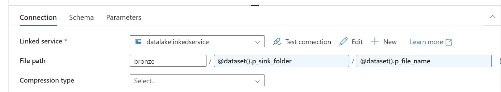

# Azure End-to-End Data Engineering Pipeline

Data Source: https://www.kaggle.com/datasets/ukveteran/adventure-works

## Architecture


## Steps followed:

Create resource group --> `AWPROJECT`

Inside resource group --> we can create different resources

Create storage account --> `lmamidiawstorage`
- Primary service: Azure Data Lake storage Gen 2
- Performance: standard
- Redundancy: Locally-redundant storage (LRS)
- Enable hierarchical namespace --> This will create Data lake insetad of blob storage
- Access tier: `Hot`
- Then create

Create azure datafactory --> `lmamidi-adf-aw`

- In Azure storage account --> Left side pane: In data storage --> click on containers
    - create 3 containers for `bronze`, `silver`, `gold` layers

- In Azure Datafactory, Open azure data factory studio
    - In Manage tab: Create `linked service`
        - Pick `http` for data source
        - Name: `httplinkedservice`
        - Base URL: `https://raw.githubusercontent.com`
        - Authentication type: Anonymous
    - In Manage tab: Create `linked service`
        - Pick `Azure Data Lake Storage Gen2` for data source
        - Name: `datalakelinkedservice`
        - Storage accoount name: `lmamidiawstorage`
    
    ### To create static pipeline (To copy data from source to destination)

    - In Author tab: create a pipleine `GitToRaw`
        - Drag "Copy Data" activity and name it as `CopyRawData`
            - In "source" tab, create new data source `http` and file format as `csv` ---> Name: `ds_http`
                - Linked service: select `httplinkedservice`
                - Relative URL: `lokesh-venkata-sai/Adventure_works_Data_Engineering_Pipeline/refs/heads/main/Data/AdventureWorks_Products.csv`
                - click OK
            - In "sink" tab, create a new sink data source `Azure Data Lake Storage Gen2` and format as `csv` ---> Name: `ds_raw`
                - Linked service: `datalakelinkedservice`
                - File path: `bronze`/`products`/`products.csv`
        - Click on "Debug" --> To run the pipeline
    - "Publish all"
    
        
    
    - since we have around 8 file we need to create 8 different pipelines. But this is not a standard approach. We should create a Dynamic pipeline.

    ### To create dynamic pipeline

    - In Author tab: create a pipleine `DynamicGitToRaw`
        - Drag "Copy Data" activity and name it as `DynamicCopyRawData`
            - In "source" tab, create new data source `http` and file format as `csv` ---> Name: `ds_http_dynamic`
                - Linked service: select `httplinkedservice`
                - In Advanced: Click on "Open this dataset"
                - Relative URL --> Add Dynamic content
                - Create a new parameter `p_rel_url` of `string` type
                - click on `p_rel_url` and OK
            - In "sink" tab, create a new sink data source `Azure Data Lake Storage Gen2` and format as `csv` ---> Name: `ds_raw_dynamic`
                - Linked service: `datalakelinkedservice`
                - In Advanced: Click on "Open this dataset"
                - File path: file system -> `bronze`
                - Directory -> add dynamic content -> Create a new parameter `p_sink_folder` of `string` type
                - File name -> add dynamic content -> Create a new parameter `p_file_name` of `string` type
            
            - Now if we see the source, sink tab in total we need to provide 3 parameters as inputs for copy activity `p_rel_url`, `p_sink_folder`, `p_file_name`
        - Before proceeding further let's upload a `git.json` file to azure in data lake storage by creating a `parameters` container
        - Drag "lookup" acticity and name as `LookupGit`
            - In settings, create a new sink data source `Azure Data Lake Storage Gen2` and format as `json` ---> Name: `ds_git_parameters`
            - Linked service: `datalakelinkedservice`
            - File path: Browse the `git.json` file
            - Uncheck "First row only"
        - Connect "Lookup" activity On success to "For each"
        
            
        
        - Drag "ForEach" activity and name it as `ForEachGit`
            - In settings tab, check the box Sequential
            - Items: Add dynamic content --> select LookupGit value array --> OK
        - Now, cut the `DynamicCopyRawData` activity --> select `ForEachGit` activity --> Inside activities tab --> click on pencil symbol --> (now we are inside foreach activity) paste `DynamicCopyRawData` activity
        - Now, select Copy Data Activity
            - Inside source tab --> `p_rel_url` Add dynamic content --> `@item().p_rel_url` (p_rel_url: parameter inside json file) --> OK
            - Do the same for other two parameters accordingly in Sink tab
    - Now, click on "Debug" to run the pipeline. 
    - You can check that files will be present inside the data lake storage.

Create Azure Databricks resource --> `adb-aw-project`

- Pricing Tier: Trail (14 days Free)
- Managed Resource group name: `managed-adb-aw-project`
- Click Create

- In compute Tab, click on + to create compute
    - Cluster Name: `AWProjectCluster`
    - Single Node
    - Access mode: No isolation shared
    - Node type: `Standard_DS3_V2`
    - Uncheck "Use Photon Acceleration"
    - Terminate After: 20

- Now, we need to setup permissions for databricks to access the data lake
    - First way: we can use microsoft entra ID to create an service application to be kept in between Databricks and datalake
    - Another way: We can use azure storage access key to access data lake
        - Run this code in spar
        ```python
        spark.conf.set(
            "fs.azure.account.key.<storage-account>.dfs.core.windows.net", "<storage-account-access-key>"
        )

- In Workspace Tab, create a folder `AW_Project`
- In `AW_Project`, create a notebook `silver_layer`
    - In top, connect to cluster `AWProjectCluster`

